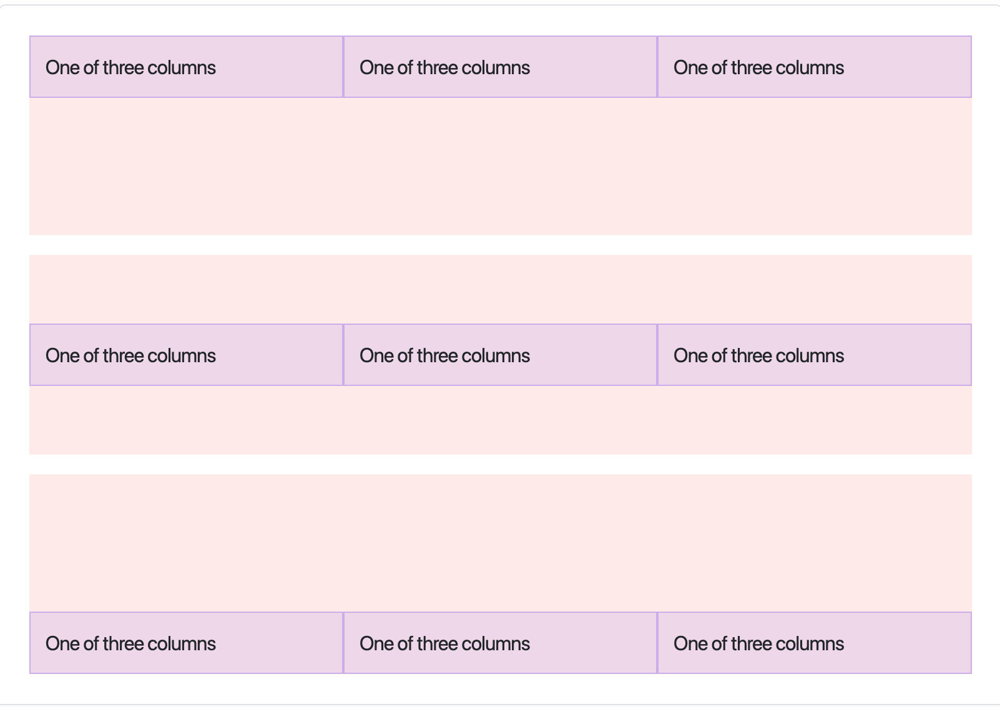
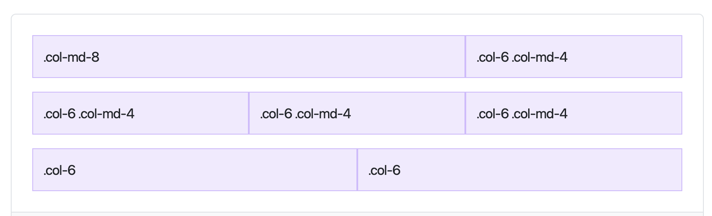
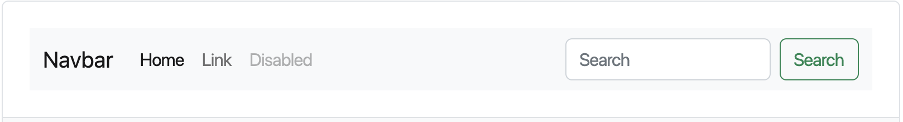
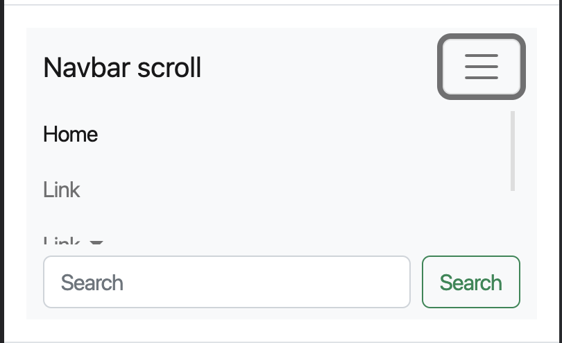
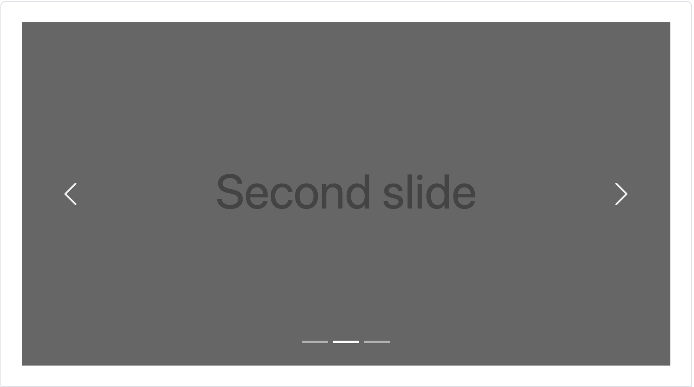

# Bootstrap cơ bản

## Installation

### Sử dụng bootstrap với CDN

Copy 2 link bên duới và paste vào dự án của bạn:

```html
<link href="https://cdn.jsdelivr.net/npm/bootstrap@5.2.0-beta1/dist/css/bootstrap.min.css" rel="stylesheet" integrity="sha384-0evHe/X+R7YkIZDRvuzKMRqM+OrBnVFBL6DOitfPri4tjfHxaWutUpFmBp4vmVor" crossorigin="anonymous">`
 
<script src="https://cdn.jsdelivr.net/npm/bootstrap@5.2.0-beta1/dist/js/bootstrap.bundle.min.js" integrity="sha384-pprn3073KE6tl6bjs2QrFaJGz5/SUsLqktiwsUTF55Jfv3qYSDhgCecCxMW52nD2" crossorigin="anonymous"></script>`
```

#### Sử dụng bootstrap bằng source file compiled

> Download ở đây [source file](https://github.com/twbs/bootstrap/releases/download/v5.2.0-beta1/bootstrap-5.2.0-beta1-dist.zip)

<div style="margin-top: 30px;">
</div>

### Các thành phần thường sử dụng khi dùng bootstrap

<div style="margin-top: 30px;">
</div>

# Layout

<div style="margin-top: 30px;">
</div>

## Breakpoints

<div style="margin-top: 10px;">
</div>

Breakpoints là chiều rộng có thể tùy chỉnh, xác định cách bố cục của bạn hoạt động trên các kích thước thiết bị mà Bootstrap cung cấp.

Các breakpoint hiện nay được BS cung cấp:


| Breakpoint  |  Class infix  | Dimensions |
|---|---|---|
|  Extra small  |  None | <576px  |
|  Small | sm  | >= 576px  |
|  Medium  | md  | >=768px  |
|  Large  | lg  |  >= 992px  |
|  Extra large   |  xl  | >=1200px  |
|  Extra extra large   |  xxl  | >=1400px  |


<div style="margin-top: 30px;">
</div>

## Container

<div style="margin-top: 10px;">
</div>


### Default container 

```html
<div class="container">
  <!-- Content here -->
</div>
```

### Responsive containers 

```html
<div class="container-sm">100% wide until small breakpoint</div>
<div class="container-md">100% wide until medium breakpoint</div>
<div class="container-lg">100% wide until large breakpoint</div>
<div class="container-xl">100% wide until extra large breakpoint</div>
<div class="container-xxl">100% wide until extra extra large breakpoint</div>
```

### Fluid containers 

Sử dụng `.container-fluid` cho các element có độ rộng full màn hình


```html
<div class="container-fluid">
  ...
</div>
```

<div style="margin-top: 30px;">
</div>

## Columns
<div style="margin-top: 20px;">
</div>

>Có 12 cột sẵn trên mỗi hàng, cho phép bạn tạo các tổ hợp phần tử khác nhau trải dài bất kỳ số lượng cột nào. Các lớp cột cho biết số lượng cột mẫu sẽ kéo dài (ví dụ: col-4 kéo dài bốn). chiều rộng được đặt theo tỷ lệ phần trăm để bạn luôn có cùng một kích thước tương đối.

<div style="margin-top: 30px;">
</div>


### Simple column




```html 
<div class="container">
  <div class="row align-items-start">
    <div class="col">
      One of three columns
    </div>
    <div class="col">
      One of three columns
    </div>
    <div class="col">
      One of three columns
    </div>
  </div>
  <div class="row align-items-center">
    <div class="col">
      One of three columns
    </div>
    <div class="col">
      One of three columns
    </div>
    <div class="col">
      One of three columns
    </div>
  </div>
  <div class="row align-items-end">
    <div class="col">
      One of three columns
    </div>
    <div class="col">
      One of three columns
    </div>
    <div class="col">
      One of three columns
    </div>
  </div>
</div>
```

### Bạn không muốn các cột của mình chỉ xếp chồng lên nhau trong một hàng? Sử dụng kết hợp các lớp khác nhau cho mỗi cấp khi cần thiết. Xem ví dụ dưới đây để biết rõ hơn về cách hoạt động của tất cả.



```html
<div class="container">
  <!-- Stack the columns on mobile by making one full-width and the other half-width -->
  <div class="row">
    <div class="col-md-8">.col-md-8</div>
    <div class="col-6 col-md-4">.col-6 .col-md-4</div>
  </div>

  <!-- Columns start at 50% wide on mobile and bump up to 33.3% wide on desktop -->
  <div class="row">
    <div class="col-6 col-md-4">.col-6 .col-md-4</div>
    <div class="col-6 col-md-4">.col-6 .col-md-4</div>
    <div class="col-6 col-md-4">.col-6 .col-md-4</div>
  </div>

  <!-- Columns are always 50% wide, on mobile and desktop -->
  <div class="row">
    <div class="col-6">.col-6</div>
    <div class="col-6">.col-6</div>
  </div>
</div>
```

<div style="margin-top: 30px;">
</div>

## Navbar

<div style="margin-top: 20px;">
</div>

### Các class cần nhớ khi sử dụng navbar của boostrap
<div style="margin-top: 20px;">
</div>

* `.navbar-brand` sử dụng cho logo - brand name.
* `.navbar-nav` để có điều hướng đủ độ cao và nhẹ (bao gồm hỗ trợ dropdown).
* `.navbar-toggler` để sử dụng với plugin thu gọn của boostrap và các hành vi chuyển đổi điều hướng khác.





```html
<nav class="navbar navbar-expand-lg bg-light">
  <div class="container-fluid">
    <a class="navbar-brand" href="#">Navbar</a>
    <button class="navbar-toggler" type="button" data-bs-toggle="collapse" data-bs-target="#navbarTogglerDemo02" aria-controls="navbarTogglerDemo02" aria-expanded="false" aria-label="Toggle navigation">
      <span class="navbar-toggler-icon"></span>
    </button>
    <div class="collapse navbar-collapse" id="navbarTogglerDemo02">
      <ul class="navbar-nav me-auto mb-2 mb-lg-0">
        <li class="nav-item">
          <a class="nav-link active" aria-current="page" href="#">Home</a>
        </li>
        <li class="nav-item">
          <a class="nav-link" href="#">Link</a>
        </li>
        <li class="nav-item">
          <a class="nav-link disabled">Disabled</a>
        </li>
      </ul>
      <form class="d-flex" role="search">
        <input class="form-control me-2" type="search" placeholder="Search" aria-label="Search">
        <button class="btn btn-outline-success" type="submit">Search</button>
      </form>
    </div>
  </div>
</nav>
```

<div style="margin-top: 30px;">
</div>

## Carousel

<div style="margin-top: 20px;">
</div>




```html
<div id="carouselExampleIndicators" class="carousel slide" data-bs-ride="true">
  <div class="carousel-indicators">
    <button type="button" data-bs-target="#carouselExampleIndicators" data-bs-slide-to="0" class="active" aria-current="true" aria-label="Slide 1"></button>
    <button type="button" data-bs-target="#carouselExampleIndicators" data-bs-slide-to="1" aria-label="Slide 2"></button>
    <button type="button" data-bs-target="#carouselExampleIndicators" data-bs-slide-to="2" aria-label="Slide 3"></button>
  </div>
  <div class="carousel-inner">
    <div class="carousel-item active">
      
    </div>
    <div class="carousel-item">
      
    </div>
    <div class="carousel-item">
      
    </div>
  </div>
  <button class="carousel-control-prev" type="button" data-bs-target="#carouselExampleIndicators" data-bs-slide="prev">
    <span class="carousel-control-prev-icon" aria-hidden="true"></span>
    <span class="visually-hidden">Previous</span>
  </button>
  <button class="carousel-control-next" type="button" data-bs-target="#carouselExampleIndicators" data-bs-slide="next">
    <span class="carousel-control-next-icon" aria-hidden="true"></span>
    <span class="visually-hidden">Next</span>
  </button>
</div>
```